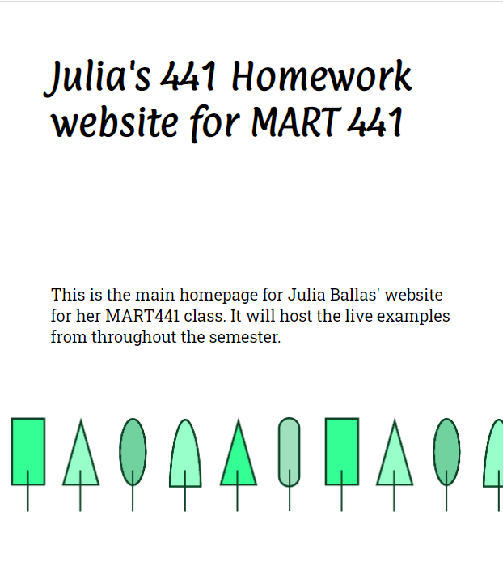
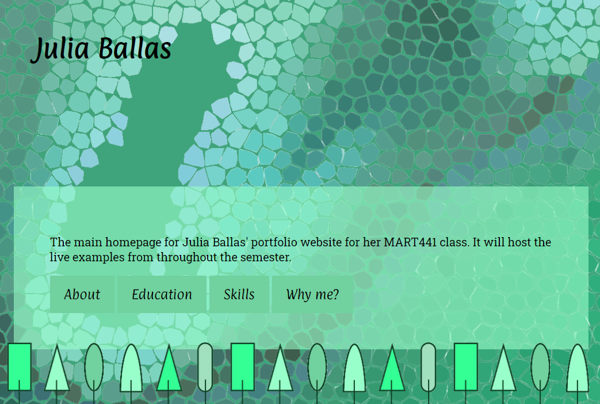

# Week 1 Response
## Date 1-21-2019
## MART441.50, Julia Ballas

## Overview
The first week begins with the setup of a new github repo and reintroduction to html and css. My main project for the semester will be a portfolio site to highlight my coding art and skills as a web designer.

## Projects

- Test site
- Portfolio site

## Assignment Details

Create a visually appealing, static webpage with mobile-first, response web design, three sections and minimum of two break points, adding in options, such as a hero image or parallax scrolling.

## Weekly Report

I began with a reintroduction to github, which I've used before in several of my classes, Creative Coding 120 and Intro to Web 341. Github is wonderful for tracking changes, and the process to do so with the github desktop is easy as long as you save and commit those changes regularly. There was a bit of re-learning curve as I remember how github works and I struggled with my organization, learning that renaming folders isn't simple as right-clicking and rename.

I started with a test website, so I could experiment and refamiliarize myself with working in HTML and CSS, but I quickly became frustrated with my workflow. Even though I laid out the html first, I did not have all the information prepared, and I added various `
` tags without much thought. Then I jumped into the CSS, so I could experiment with `float` and `padding` and `borders`. But I quickly started bouncing around within my CSS document, adding in margins and fonts and color. All of this was too experimental, and without a focused plan or any main idea or theme, I felt like I wasn't accomplishing anything. Time to pause and organize my thoughts.

Here's how the test site looked when I finished, with bright colors and borders and random text.

### Theme
I'm building myself a portfolio website to feature coding art and website design ideas.

I need a section to highlight my skills and inspirations, and a section to describe what makes my designs uniquey mine.

Since my coding artwork tends to be simple and block-like, I'm going to have a simple illustration-style with trees and my favorite colors, in the green spectrum.

 Here is my first attempt.

After adding the tree footer, my next task was to add the sections and the background image. Mostly, because I was struggling so much with the basics, I did not have time this week to really get the artwork and aesthetic I wanted. I added a fixed background and my sections scoll over it, but it doesn't appear to be a parallax effect, at least not in my mind. I think I needed to have more background artwork within the sections. Or larger background artwork. I attempted to use the rpg alpha setting to change up the 'colors' of each section, but the effect is very subtle. It also means my css document uses both hex and rgb, but I think looks sloppy.

Final website

### Sources
I relied heavily on the W3Schools reference pages for HTML, CSS (https://www.w3schools.com/default.asp) and their "How to - parallax scrolling" for my background image code. (https://www.w3schools.com/howto/howto_css_parallax.asp). I also used Jon Duckett's *HTML&CSS design and build websites* as a refresher on basics html and css.

## Problems or Issues this week
Like any new language, when you stop using it, or stop learning new words you will quickly forget details. Everything took twice as long, since I had to constantly look up information. Even if I can read html and css, I can't remember any specifics, so it was very frustrating to do even the most simple tasks.

Everything I forgot
- Buttons
- linking my css file
- linking images
- padding
- margins
- borders
- links in general
- linking fonts externally
- psuedo class
- display inline vs block

## Specific questions/concerns for next week

I need to study more about responsive images for next week. I didn't add any @media tags, because I didn't feel it was necessary with my vector artwork. If I used photos, that would have been important to add to the css. I want to continue to focus on mobie first design in the weeks ahead.

How do I get that cascading appearance in your index html? Do you just tab inward for each new tag?

The fonts I choose this week are too simple. I need to continue to study web-safe typography and take more risks with different, crazier fonts.

## Conclusion
In some ways I liked the minimalist layout I designed, but I also prefer my test layout for its Mondrian-like composition. The reintroduction to coding reminded me how important it is to practice, practice, practice.  
