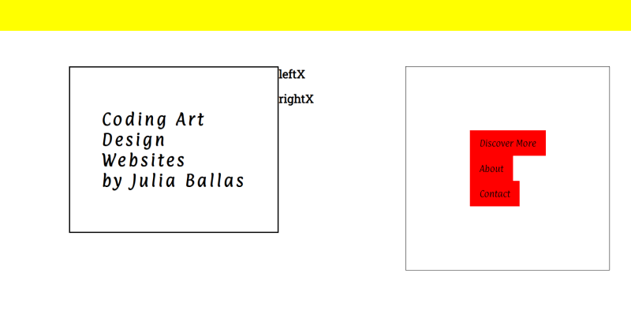

# Week 1 Response
## Date
## MART441.50, Julia Ballas

## Overview
The first week begins with the setup of a new github repo and reintroduction to html and css. My main project for the semester will be a portfolio site to highlight my coding art and skills as a web designer.

## Projects

- Test site
- Portfolio site

## Assignment Details

Create a visually appealing, static webpage with mobile-first, response web design, and minimum of two break points, adding in options, such as a hero image or parallax scrolling.

## Weekly Report

I began with a reintroduction to github, which I've used before in several of my classes, Creative Coding 1 and Intro to Web. It's wonderful for tracking changes through github, and the process to do so with the github desktop is easy, as long as you save and commit those changes regularly. I struggled a bit with my organization, as renaming folders isn't simple as right-clicking and rename.

I started with a test website, so I could experiment and refamiliarize myself with working in HTML and CSS, but I quickly became frustrated with my workflow. Even though I layed out the html first, I did not have all the information prepared, and I added various `
` tags without much thought. Then I jumped into the CSS, so I could experiment with `float` and `padding` and `borders`. But I quickly started bouncing around within my CSS document, adding in margins and fonts and color. All of this was too experimental, and without a focused plan or any ideas to go off, I didn't feel like I was accomplishing anything. Time to pause and organize my thoughts.

Here's how the test site looked when I finished, with bright colors and borders and random text.

### Theme
I'm building myself a portfolio website to feature coding art and website design ideas.

I need a section to highlight my skills and inspirations, and a section to describe what makes my designs uniquely mine.

## Problems or Issues this week
Like any new language, when you stop using it, or learning new words you will quickly forget details. I can read html and css, but I can't remember specifics. This week I ended up looking up simple things, like how to make comments in both HTML and CSS.

Buttons are convenient, but styling them was a struggle. I basically had to reference W3 schools to see how to style, and size them evenly. It feels like I don't know how to do anything without looking up details.

## Specific questions/concerns for next week

## Conclusion
