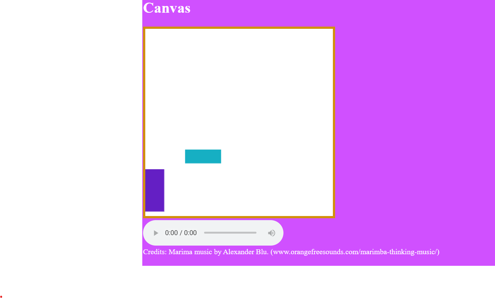
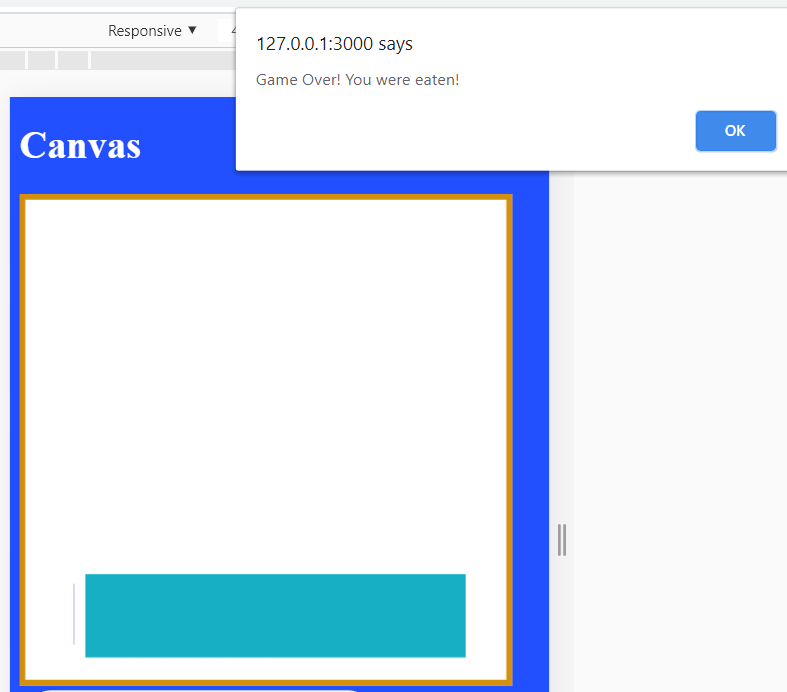

# Week 11 Response
## Date 3-30-20
## MART441.50, Julia Ballas


## Overview

This week we finally start focusing on HMTL5 and game mechanics.

## Projects

- project 10 game basics
-

## Assignment Details

Setup a basic game scenario with two objects that can interact.


## Weekly Report

Our lessons this week were very hands-on, meaning we had a lot of coding challenges and debugging. I began with the simple task of making some HTML 5 rectangles move across the screen, animated and then with controls. Immediately, I wanted to have both objects on screen and I jumped straight into making a class called `class Bug`.

I didn't have any idea what kind of game this would create, or other game mechanics or the game's theme, I just wanted to focus on coding. But I didn't have a plan, so I jumped from one part of the project to another. This lack of planning, made the week feel unfocused and my code very unorganized. It definetely helps me to have a gameplan.

## Boundaries

After creating my bugs and getting ne ones to appear. I had to figure out movement and keeping the bugs on screen.

First, I created an object named `blue_bug` that ran diagonal across the screen. However, I could not remember how to make it bounce. I remembered doing this in my p5.js class. You had to multiple something by -1, but the math just eluded me. So I ended up looking up a hint from the p5.js website. Using their example of a bouncing ball, I created a moving object that bounced against the canvas boundary. (https://p5js.org/examples/motion-bounce.html)

## Objects Interacting


My second bug was the player controlled bug, named `player_bug`. After creating my second bug I struggled to figure out how to make one bug animated and the other controlled by keypress. I could put my movement function into the class, but that meant both of them were animated.

So I had to create a function that could effect my object. Initially, I did this with variables. I manipulated the global variables. But I realized this was not a good solution. I needed to have my functions be generic. Then, as I began to work on the object collsion and I noticed the parameters in that function.

`function boxes_collide(object1, object2)`

I realized I could use this type of parameter to select my object in other functions. I fixed my function called `function move()` so that it was `function move(object)` and then when I called it I used the code `move(blue_bug)`.

I also ended up using this idea again with my player bug, to make sure that my `.keypress` targeted the player object.

```JS
$(this).keypress(function(event){
  getKey(event, player_bug);
  stay_in_bounds(player_bug);

});
```


## Problems or Issues this week
I had two major problems this week. One involved collision. I couldn't get my objects to collide. Hours of debugging later, I found out I'd merely mistyped in the collision example wrong. I had < instead of > or object2.width instead of object1.width. It is always so frustrating when I have syntax errors, where I can't get help from the console, because I feel helpless and then stupid afterward.

I had another simple error that was giving me problems with my animation. For some reason I changed my movement `direction` variable into a local variable and I could no longer get my object to bounce. I didn't realize why it stopped working, until I changed back to a global variable and it worked.

While, it was easy to get my audio into the screen, having it play was a different matter. I

## Conclusion
My final project is going to be a game, so I really wanted to get these code down. Instead, I felt rather unorganized and did not feel like I was making a game at all. It wasn't until I got the code to work that I came up with a game scenario. You have 2 bugs on screen. The player must to avoid the bouncing bug, or else they'll be eaten. That's the game. You can lose apparently, but not win. It's a bug eat bug world out there.

Coding can only take a game so far, it needs to have a narrative of some kind in order to make it an acutal game.


