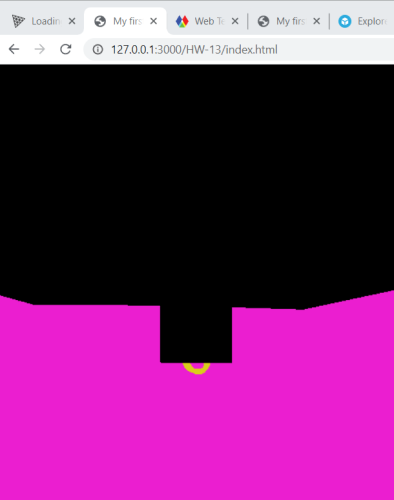

# Week 13 Response
## Date 4-20-20
## MART441.50, Julia Ballas

## Overview

This week was a quick introduction to the javascript library three.js

## Projects

- 3D Wedding Invitation

## Assignment Details

Create a project using 3D models, shapes and text using three.js

## Weekly Report

### Shapes
After adding the basic cube shape, I did some digging into other shapes available in three.js geometry. I settled on the torus. Then I manipulated the parameters until I got a thin ring shape. I added a second ring and had it spin at a difference value, so it looked like two intertwinning golden rings.

At this point I knew I wanted to make a 3D wedding invitation, with spinning rings and a forest scene below.

### Models

My only experiments with 3D models was creating one in photoshop once, but since Photoshop doesn't allow you to export in the format we need for three.js, I had to look for some available online. I downloaded a free low-poly pine tree from Sketchfab/theCrafter. And then spent hours trying to figure out how to display it. After troubleshooting and watching the lessons again and researching my error, I finally figured out I was using the wrong loader file, and I had the wrong type of 3D model. After resaving, I had it displayed, but it did not display how I wanted it.

The screenshot above shows the 3D model tree was not green and it was huge compared to my rings. It was also displayed in the same position as the rings and not a below. I needed to fixt these three things.

- color
- size/ scale FIXED

https://discourse.threejs.org/t/solved-glb-model-is-very-dark/6258

- position
- camera angle

## TEXT for Invitation
I needed a script font, so I converted one of google's free fonts named Kaushan Regular into a json file. I used this free website to do the conversion.

https://gero3.github.io/facetype.js/

## Problems or Issues this week

## Specific questions/concerns for next week

## Conclusion
