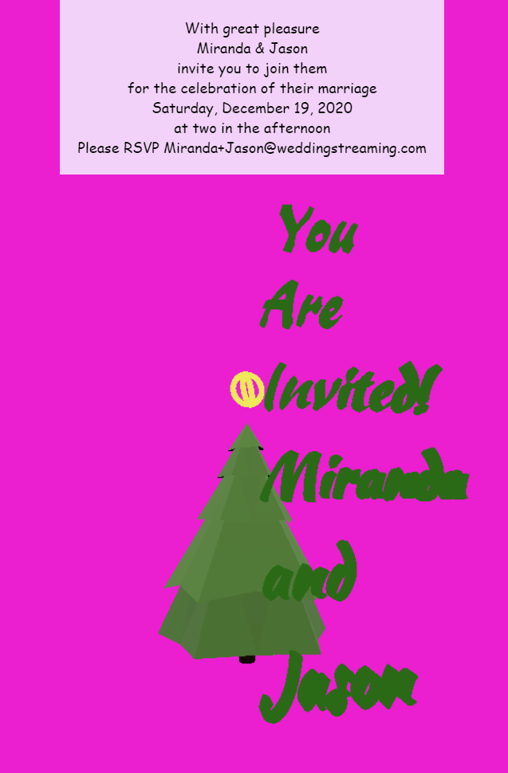

# Week 13 Response
## Date 4-20-20
## MART441.50, Julia Ballas


## Overview

This week was a quick introduction to the javascript library three.js

## Projects

- 3D Wedding Invitation

## Assignment Details

Create a project using 3D models, shapes and text using three.js

## Weekly Report

### Shapes
After adding the basic cube shape, I did some digging into other shapes available in three.js geometry. I settled on the torus. Then I manipulated the parameters until I got a thin ring shape. I added a second ring and had it spin at a different value, so it looked like two intertwinning golden rings.

At this point I knew I absolutely had to make a 3D wedding invitation, with spinning rings and a forest scene below.

### Models

I've only created a 3D model in photoshop, but since Photoshop doesn't allow you to export in the format we need for three.js, so I looked online and I downloaded a free low-poly pine tree from Sketchfab/theCrafter. Then the struggles began. It took hours to just display this model. That's because I was using the wrong loader file from three.js library. I also had the wrong type of 3D model. So, after converting the model from a gflt to a glb, I had it displayed, but it was huge compared to my rings.


The screenshot above shows the 3D model tree was not green and the wrong size. It was also appearing in the same position as the rings and not below. I needed to fix a few things.

- color FIXED
- size/ scale FIXED
- position FIXED
- camera angle tweaked

I fixed the color by adding in some lighting. I choose directional lighting and had it shine from above.

The scale was harder to fix, because I didn't understand the name of my object and how to scale it down. However, after a few more hours of research, I found a website forum post describing how to fix a dark model. (https://discourse.threejs.org/t/solved-glb-model-is-very-dark/6258) When loading their model they used `scale.set(1,1,1)` and `position.set(0,0,0)` for the position of the model. The hardest part for me was figuring out I had to have `gltf.scene` in addition to the `.scale.set(1,1,1)`. Here was my final solution:

```JS
function load_model(){
  loader.load('models/pine.glb', function(gltf) {

    scene.add(gltf.scene);
    gltf.scene.scale.set(.15,.15,.15); // THIS finally fixes the scale of model
      gltf.scene.position.set(0, -40, 0); // This moves the position of the model lower

}, undefined, function(error) {
    console.error(error);
});
}
```

## TEXT for Invitation
I wanted a script font, so I converted one of google's free fonts named Kaushan Regular into a json file. I used this free website to do the conversion. (https://gero3.github.io/facetype.js/)

I had some trouble loading the font, but used the example from Week 14 lessons. Once again I has strange position, right in the middle of the scene. It overlapped with my tree and was not readable. Not that text would ever be readable in 3D. I still needed to adjust the posistion, somehow.

I tried to follow my solution for the model, and added this `text.position.set(0,20,10);` This shifted the 3D text to the side of my model. Initially I was hoping to move it above, but the side worked.

To add the rest of my invitation text, I used three.js's suggestion and added some HTML and CSS. The code below created a text box above the 3D scene.

```CSS
div{ position: absolute;
  left: 200px;
  top 0px;
  background-color: #f3d2f9;
  padding: 20px;
  text-align: center;
  ```

## Problems or Issues this week

I struggled with the tutorials this week. I read the tips and tricks page, but it was like reading a foreign language. Also, Three.js website has examples, but their examples do not show the code used. I had to dig through the developer tools to try and understand what the examples were doing, and it rarely helped. I had a very specific problem and didn't know how to fix it.

Luckily, after I took a break, I was able to come back with fresh eyes and find my solution.

## Conclusion

Once I started playing with the shapes and created two revolving rings, I knew immediately what I wanted to create. A 3D wedding invitation, but having this vision limited me. I couldn't just experiment and see what might happen. I had no flexibility with this project. I needed to make sure the tree was exactly where I wanted and at the right size, so I struggled trying to make this happen. Sometimes, I think I enjoy art when I experiment and do have any expectations for the result.

 
