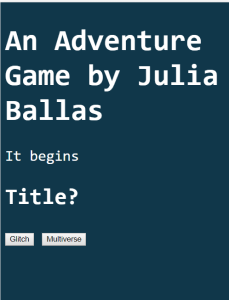
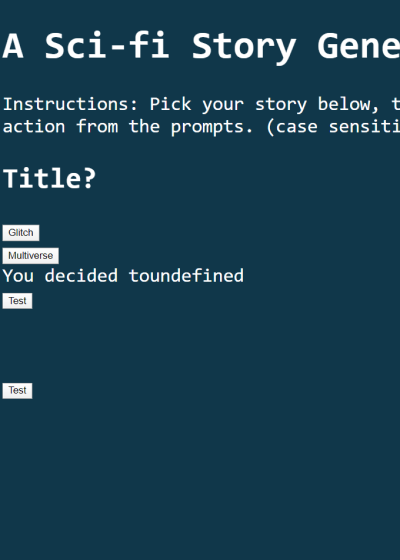

# Week 3 Response
## Date
## MART441.50, Julia Ballas


## Overview

## Projects

- Choose Your Own Adventure: Glitch and Multiverse

## Assignment Details
This week we are creating a choose your own Adventure game, using javascript.


## Step by Step Weekly Report

1. Pre-production:
  1. Story
  2. Art
  3. colors
  4. font
2. Coding
3. HTML structure
  1. divs
  2. float and position
  3. images?
  4. menu at top
4. Css style
  1. `:hover` preview feature and font changes
  2.  button
  3.  Add fonts

5. testing the game
6. finalize

My first step in making my Adventure Game was pre-production. I knew the code was going to challenge me, so I wanted the story and art selected fast. This way I could focus on the code.

### Coding
My first success was a simple JS script.
```JS
<script>
  document.write("It begins");
  document.write("<h2>Title?</h2>");
</script>
```

It works! I added text to DOM with document.write.
Now, how do I make the choices? I'll need to use an if statement, or if/else statement, or if/if/else statements.

### Progression

so.. okay. I got my if statements to work, sorta. I'm still getting and error when you don't type the correct word. Mostly, I don't like using the window.prompt because it loads before my text. So you don't even see the text before it prompts you... Is this really how its going to play out? -- Can I make a button instead? Use a do.while()

So I did some research on the `<button>` tag and learned there is a `onclick` action. (reference: https://www.w3schools.com/jsref/dom_obj_pushbutton.asp) So now when you click the button it updates the DOM and adds text to a `<div>`. Unfortunately, when I added a second button, for my second choice. The same message is printed. So...I think I need to use more variables. At least I'm closer...
 

Small success today. I have 2 buttons when you click one, text appears. So the button work, but I only fixed it by making 2 functions with different text. That is not efficent at all. I don't know how to fix it.

Also, I've run into a problem on the second level of choices. I can't use the button prompt anymore. There is an error whenever I try to put another button inside. No idea why. So I can't get to the second choice. window.prompt has the same problem. it shows up before the text.

So, I may have to just have a start button, that prompts the first choice, which lays out text, and then how do I get the second prompt after the text is shown? hmmm. puzzling.

I created a story generator, not a choose your adventure game. I can make prompts appear, and based on choices, then the story appears all at once. That's the story generator. But I'm trying to build a game. This will require more buttons, and since I can't made the buttons appear, I'll just have to have the buttons already there. The last option can be a prompt, maybe.

Have I achieve button sucess? I was struggling to get a button to appear after a choice, and also allow me to click on it. The `onclick` kept giving me an error. But somehow I managed to make the button a variable and it appeared, and I could click on it and a prompt appears. So, partial success. Now, I have to figure out how I did this and replicated it.

 
I am so silly. I needed to make a variable and assign it a string that I could call inside the document.getElementById.

That was so much harder than it should have been. But I figured it out. Successful code is below.
```
explore = "<button onclick=picked_explore()>Explore</button>";
sell = "<button onclick=pick_desire3()>Sell</button>";

if (title2==="multiverse"){
  document.getElementById("multi_act1").innerHTML = "Multiverse, featuring Sundra Dee. <p>Sundra Dee visits the amusement park named Quarkland, riding the most boring ride in the world. She falls into a trace. When she leaves the ride she discovers she is in a new universe!</p>" + explore + sell ;
  }
  ```

## Problems or Issues this week
Do I need a loop?

I have an if statement, so that if someone doesn't put the correct choice I need to keep asking until they do. Will a loop work? Or will they get stuck in it. And to unstuck them, do I need my if-statement as a function?

All my errors so far are because I misspelled: device, function

I was struggling with if/else if/else and realized, I just needed 2 if statements.

## Specific questions/concerns for next week

## Conclusion
