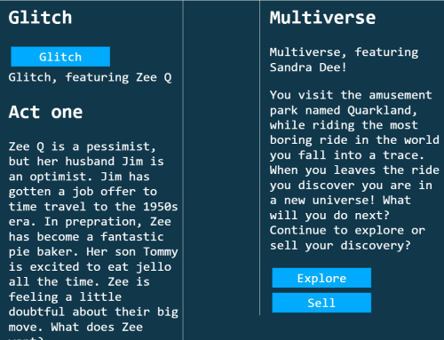

# Week 3 Response
## Date
## MART441.50, Julia Ballas


## Overview

## Projects

- Choose Your Own Adventure: Glitch and Multiverse

## Assignment Details
This week we are creating a choose your own Adventure game, using javascript.


## Step by Step Weekly Report

1. Pre-production:
  1. Story
  2. Art
  3. colors
  4. font
2. Coding
3. HTML structure
  1. divs
  2. images?
  3. navigation with 'about' hover

4. Css style
  1. `:hover` font changes
  2.  button
  3.  Add fonts
  4. float and position
  5.  images? hover? preview?

5. testing the game
6. finalize

My first step in making my Adventure Game was pre-production. I knew the code was going to challenge me, so I wanted the story and art ready to impliment. This way I could focus on the code.

### Coding
My first success was a simple JS script.
```JS
<script>
  document.write("It begins");
  document.write("<h2>Title?</h2>");
</script>
```

It works! I added text to DOM with document.write.
Now, how do I make the choices? I'll need to use an if statement, or if/else statement, or if/if/else statements.

### Progression

I didn't really know where to start, I began experimenting and failing, and experimenting some more. I got distracted by wanting to put buttons into my story. At one point I had too many buttons. It felt like taking one step forward and facing an impossibly huge wall, sometimes I was going backwards and my code was ugly. )(Luckily, I discovered this website called https://beautifier.io/. It was supposed to make your code beautiful and make it easier to see errors.)

###
Mostly, I don't like using the window.prompt because it loads before my text. So you don't even see the text before it prompts you... Is this really how the game plays out? -- Can I make a button instead?

So I emailed my teacher, and I did some research on the `<button>` tag and learned there is a `onclick` action. (reference: https://www.w3schools.com/jsref/dom_obj_pushbutton.asp) Now when you click the button it updates the DOM and adds text to a `<div>`. Unfortunately, when I added a second button, for my second choice. The same message is printed. So...I think I need to use more variables. At least I'm closer...
 

### Day 2
Small success today. I made 2 buttons when you click one, text appears. So the button work, but I only fixed it by making 2 functions with different text. That is not efficent at all. I don't know how to fix it.

Also, I've run into a problem on the second level of choices. I can't use the button anymore. There is an error whenever I try to put another button inside. No idea why. So I can't get to the second choice.

So, I may have to just have a start button, that prompts for the first choice, which lays out text, and then how do I get the second prompt after the text is shown? hmmm. puzzling.

### Prompts and Text generation, one step forward

I created a story generator, but its not a choose your adventure game. I can make prompts appear, and based on your choices, then a story appears all at once. I'm calling the story Glitch. Its a story generator, though, and I'm trying to build a game. This will require more buttons, and since I can't made the buttons appear, what if I already have the buttons in the HTML? (nope.)

Below is supposed to be a function that writes information to the DOM, only it can't write the button. What if I use document.write make a button appear? no...

```JS
       function desire_button(){
            document.getElementById("second-act").innerHTML = "<h2>Next Chapter</h2> <button>Explore</button>"; // I can't get this button to work. That's where I'm stuck.

            document.write("<button>Testing</button>"); // This doesn't work either. It appeared on a new screen, not the same. Oh, I get it. Because it's in a function it overwrites all the html in the document. Which makes a blank screen and only the button.
          }
```
            What about using an if statement?
```JS
            if (title2=== "multiverse"){
              document.write("Testing");
            }                                   // Nope. nothing appeared.
```
Could I make the button a variable? Would that works?

### Successful code?

Have I achieve button sucess? I was struggling to get a flickable button to appear after a choice. The `onclick` kept giving me an error. But somehow I managed to make the button a variable and it appeared, and I could click on it and a prompt appears. So, partial success. Now, I have to figure out how I did this and replicated it.

 
The button appears successfull, except there are 2 buttons.

I am so silly. It turns out all I needed to do was to make a variable that I could call inside the document.getElementById.

That was so much harder than it should have been. But I figured it out. Successful code is below.
```
let explore = "<button onclick=picked_explore()>Explore</button>";
let sell = "<button onclick=pick_desire3()>Sell</button>";

if (title2==="multiverse"){
  document.getElementById("multi_act1").innerHTML = "Multiverse, featuring Sundra Dee. <p>Sundra Dee visits the amusement park named Quarkland, riding the most boring ride in the world. She falls into a trace. When she leaves the ride she discovers she is in a new universe!</p>" + explore + sell ;
  }
``` 

## Problems or Issues this week
Somehow the idea of using a variable inside the `document.getElementById` kept eluding me, but I came around to the realization eventually. After that breakthrough it was just replicating that throughout the story-tree, finishing up my css and cleaning up my code.

## Conclusion
I kept my first attempt, *Glitch*, because it uses prompts and writes information to the DOM, but I prefer the *Multiverse* story. The buttons feel more like a game.

I spent a long time iterating to get my button to work. This week reminded me how much coding is a process. I really couldn't see my way forward at one point, but the advice from my teacher helped get me started, and I kept working at it. I could have tried to use the forum, but I wasn't confident I could explain my problem. I'll work on this going forward.
