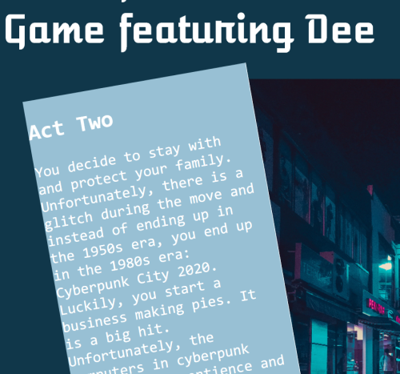

# Week 4 Response
## Date
## MART441.50, Julia Ballas


## Overview
We continue our study of functions, variables and

## Projects

- Adventure Text Game, expanded
-

## Assignment Details

Add to the Adventure Text Game created during week 3, including text input from the player and more functions.


### Homework requirements
1. Add a text input box to input the charcter's name
2. add a for loop, or while loop
3. Add an if/else if/ else or switch statements
4. add a parameter within a function
5. return a value from a function
6. add a restart button to restart the story
  - & Change where the story appears. So the buttons disappear!! One div Story box!!
7. update the style/images with javascript function
8. Make sure there are 5 choices to the story
  - I have a total of 8 endings already, its just each path doesn't include 5 choices, but the way I laid out my story that would mean 32 endings and I don't think that's fessible.

## Weekly Report
This week intimidated me for a weird reason. I didn't know where to begin, since I already had created a game. I had a list of things I needed to impliment, but I wasn't sure where I could add them. I think I was afraid of breaking the game. So, I started with an issue I had last week with inefficent code.


### Fixing Pick Title Function / simplying with functions and parameters
Last time I had two functions that basically did the same thing. `pick_title()` and `pick_title2()`. When you clicked on a title button then one of functions ran. Click on the other button and a differen function ran. It worked, but made the code cluttered.

I needed one `pick_title()` function to go to the *Glitch* story or *Multiverse* story.

My solution was the switch statement and parameters.

```JS
function pick_title(title) {

    switch (title){

        case 1:
            story(title);
            break;

        case 2:
            story(title);
            break;
  }
}
```
I also replicated this idea so there was 1 variable for desire and one for action too. The code looked much cleaner afterward.

### Layout update
Previously, I had two columns, so one story appeared on the left and one on the right. Now, I've combined the stories so they only show up in one main story box. This involved fixing cleaning up the HTML and updating my script.js.

### Style changes


I created a `new_universe()` function so that whenever the player enters a new universe in the story the style is updated. It rotated and changed fonts and background colors. The style change is also randomized. I used `Math.random` and made sure it rounded the number, so it was 0 or 1.

## Problems or Issues this week: one word Loops

I designed my text game to have all the text appear from Javascript. I don't have anything that repeats. So I didn't need to use a loop. I struggled to come with any creative way of add a loop or a whole or do whole. No useful ideas.

It is very useful when you need to repeat an action, or image or whatever. I attempted to add loops with a `document.getElementById` and you don't see it change 7 times, because it is changing the same innerHTML. I also tried to use `document.getByClassName` because you need to have the information already available to update it. But my information isn't available until after you click a button, so I just get an error with that code.

I ended up adding a loop that makes an alert popup 7 times. It is perhaps the most annoying loop I could have imagined, but it also perfectly reflects how annoyed I felt trying to impliment a loop into my text game.

## Changing HTML with Class Name

On the forum @wattse13 and I were discussing his struggle to change the name in his story. I did some research into it, because I wanted to be able to do the same thing in my story, and at first I couldn't get `document.getByClassName` to change anything.

I found a helpful hint from
https://www.geeksforgeeks.org/html-dom-getelementsbyclassname-method/

Then I created 2 funtions. One creates a text input box and the other changes the text that is already on the page. That was very important. I think I was struggling because my story is entirely in the script and not in my HTML. I can only change anything after it appears. So, that's why I implimented the two new funtions. `extra_choices()` and `food()`

But it isn't very effective, and changes don't carry over into the next section. I'm leaving it there, as my attempt to change HTML and get more user input.

## Questions
Do I need to add IDs to all my buttons. Is it important to have an id even if I'm never going to reference that individual id?

## Conclusion
Cleaner code is easier to work with, not just having the spacing and line breaks, but having logical flow helps too. It was very satisfying to make my functions work better. I felt like I didn't really expand my game, just tided it up. I'm curious how other people made their games, so I'm going to share my game for Week 4 along with my resources in this week's forum.
