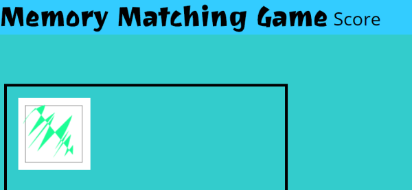
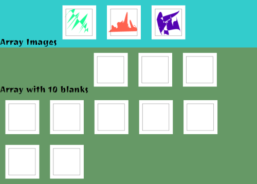

# Week 5 Response
## Date
## MART441.50, Julia Ballas

## Overview

Week 5 we begin to explore arrays and we'll be making a memory matching game.

## Projects

- Memory Game part 1
-

## Assignment Details

Setup 10 blank images and figure out how to flip them over to show the random real images, using arrays, and loops and random.

## Process

1. Artwork
2. Html/css
3. Coding

### Goal 1 How do you make an image Clickable?

Google search yielded a couple of options:
Make a button with a background image. Or you could use the `` tag and attach an onclick event to it. (https://stackoverflow.com/questions/8542083/inserting-a-clickable-image)

I added some css to have a `:hover` effect, to show when you're over the image. Then I fixed my syntax adding the `onclick` event, thanks to W3Schools (https://www.w3schools.com/jsref/event_onclick.asp)

### goal 2 make arrays with images

So, I have only 1 image with blank, how do I fill the array with ten of these blank images. Using a for loop inside the array. Let's make the array with 2 images first.

Success! The code is a little messy, but I have two arrays. one for images and one for blanks. For the blanks I added 2 loops. one to push the same image to the array and another to display all items in the array.

### Goal 3 Make images from array clickable

Now I just need to combine the clickable part with my arrays. I used IDs in my images... before. Maybe I have to rethink how to make them clickable....

## Problems or Issues this week

## Specific questions/concerns for next week

## Conclusion
