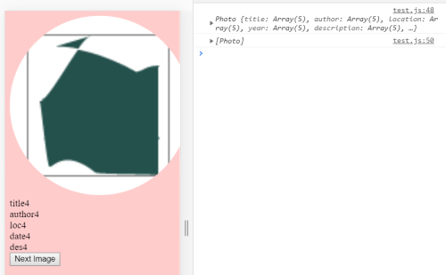
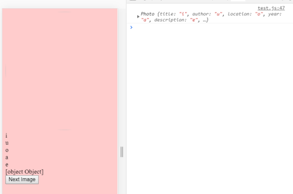

# Week 7 Response
## Date 3-1-20
## MART441.50, Julia Ballas


## Overview

We begin our study of Javascript Objects this week, studying classes, and constructors.

## Projects

- Photoviewer.js
- script.js
- CSS animation experiment

## Assignment Details

Create a class and photoviewer to display and switch between photos.

## Process

1. Basic HTMl
  - Use -placeholder images for now.-
2. Coding
  - Create class
  - constructors
  - methods
3. CSS
   - Add images
   - research clip-path and SVG
   - research animation

### Class and Object study

I'm switching up my process this week, I want to focus first on coding the basics, then try to expand upon the design with some css.

### Photoviewer Version 1

A screenshot showing all the arrays in my console. This was a bad idea.

For some reason, my first instinct was to create arrays with all the details. This meant 5 different arrays that I would access with my object. But it also meant I was only creating one object over and over, with different random elements. (I saved the code here: https://github.com/jballas/441_work/blob/master/HW-7/photoview.js)

It worked, but that was not the goal of our project. We need to have a class and then create 5 different objects.

Strangely, whenever I tackle the homework wrong, I have such a hard time forgetting my old code. Next time I will going to start a new file from scratch, so that I don't get distracted by old code.

### Photoviewer Version 2

I watched the homework example to get an idea of which direction I needed to go. This time I created an actual `toString`, following our lesson.

Once I got the image and details to display, I figured out how to push my new objects into an array, but I couldn't seem to display from that array correctly.

I had my `display()` function tied to my button, and this pushed the same objects into my array everytime.

```JS
function new_photo() {
// display();
// Problem: calling the display() function here continues to push them into the array???
// Solution: I had it in the wrong place. We needed to load it once, using the <body onload="display();" > Otherwise, yes, it will continue to push the images into the array every single time I click a button.
}
```

Luckily, it was an easy solution. I needed to call my display fuction once inside the html page, like so `<body onload="display();">` This solved my problem. I am trying to only watch the example videos when I get stuck. This worked pretty well. I think I have my code down now, I just need to add more objects, and actual images.

Below is a screenshot of my successful code


## CSS animation
I feel like there is a lot of CSS available that I'm not familiar with. I wanted to try some simple animation this week. I experimented with the `clip-path` on my images unfortunately, animating it wasn't working, so I  created a  triangle logo and warped it strangely. It is a start.

## Problems or Issues

When I began the project, I gave myself a simple task, create a class and display one image. It is amazing to me how end one simple task goes completely wrong when you don't connect the dots. I thought I had everything (I did), however nothing was displaying. It turns out I wasn't linking my script file correctly. One simple error. Anyway, once I discovered that, my image appeared.


The screenshot above shows how I struggled to get the information to appear from my arrays. I realize I was tackling the homework wrong now, but I I got some practice debugging and using Arrays. In this case, instead showing of displaying the entire string, it only did the first letter from the string. It was truly bizarre and amusing to see that happen.

## Specific questions/concerns for next week

There must be an easier way to create objects and push them into an array. Rather than having 5 different variables.

Sometimes the random images don't change. This bugs me. How can you prevent this from happening? This kind of problem is where I struggle with javascript.

## Conclusion

This week was a good lesson on the value of creating a class and objects in Javascript. As I added more images, I realized how much easier it was to create a new object, as opposed to adding details to an Array. I could have added in dozens of more images and I would have only had to update that one function.
