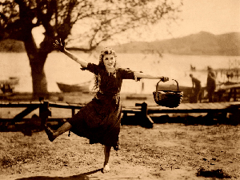

# Week 8 Response
## Date
## MART441.50, Julia Ballas


## Overview
This week begins our exploration into the javascript library known as jQuery. Using jQuery will simply our code and allow us to experiment with animation.

## Projects

- jQuery art project: silent movie
-

## Assignment Details

Create a jQuery based art project, with shapes, words, images that are animated and fade in and out.

## Process

- HTML and CSS
  - create main page with border and play movie button
- Coding
  - add jquery to make the star flicker


### Attempt to make Twinkling stars

This week I was suprised how much time I spent getting my css established, but it makes sense since jQuery relies on manipulating the css. I set up stars in my project and started with one fading in and out. But they didn't do this continuously. I want the efffect to keep happening until the button is pushed.

A loop made the star `fadeIn()` and `fadeOut()` for 5 times, and then it will `fadeToggle()` when you push the button. But that's not what I want. I want it to keep flickering, until you push the button.

I tried using the `mouseenter()`, but that created a weird bug that would allow stars to reappear if the mouse enters during the movie. I still want to see a repeating loop. At the very least I can have a loop that plays it 5 times. It should have a delay between loops though... Another tricky problem.

`setInterval()` worked best. It runs contiuously, then clicking the button with class jQuery's `.hide()`. However, it is not ideal, since pushing the button in the middle of the star's flicking sequence they'll keep at it, and eventually disappear. The stars are located inside `<div>` tags I'm using in my movie. Sometimes they reappear. So, it sorta works with `setInterval()` and sorta doesn't.

### Images
After I added basic text into my 'movie', adding the images gave me trouble. I found the solution for adding images at Stack Overflow. By using jquery's `.attr` and accessing the source, I can just change an empty image, like we did during week 5 and 6. ( https://stackoverflow.com/questions/554273/changing-the-image-source-using-jquery)


Now, I have a crazy animated images that overlay. However, they don't rotate through my array. I tried randomizing the images, like we did in Week 5, but the variable only picked one random number from the array. So all the images come out the same, even though it was a random image. No good.

In order to move forward, I tried taking a step back and removed all my animation/fading experiments. Then I tried  tackling it again with a fresh set of eyes. It didn't really help, since I just ran into more deadends and more bizarre problems with my arrays and

The animation gets out of control so quickly. Several times I just stared at my screen wondering why I had one  image fading in and out 10 tens. That was not in my code, not that I could tell, anyway.

### Hidden About div

During my struggle with the images, I took a short break and created a hidden about button. The jQuery made it easy, using the `slideToggle()` The hardest part was getting the button to match my other home link, which involved changing my css

## Problems or Issues this week

Using an array to rotate through my images didn't work this week. I believe I was struggling because there was no click event to rotate them. In our previous projects we used an event to change things. Whether it was clicking on a blank image to reveal the acutal image, or clicking on a button to reveal another random object. But my movie is 'automated' in a way. After you click the button once it 'plays' and the sequence of images and words appear in various `div` tags with Ids.
```
    // image appears from the array
      $('#title_card2').html(image[0]);

```

```
    // only one image appears from the array
      $('#title_card2').html(image[0]).fadeOut(2000, function(){
        $('#title_card2').html(image[2])
        });
```
Experiment # 3, causing a strobe effect, where both images flashed one screen one after the other.
```
$('#movie_image').attr('src', './images/mary-pickford.jpg').fadeOut( function(){
  $('#movie_image').attr('src', './images/john-gilbert.jpg').fadeIn();
  });
```


Experiment # 4
```
$('#title_card').html("").fadeOut(2000, function(){
  $('#movie').attr('src', './images/john-gilbert.jpg').fadeIn();
  });
```

fadeToggle, just made the images fade in and out over and over.


## Specific questions/concerns for next week

## Conclusion
