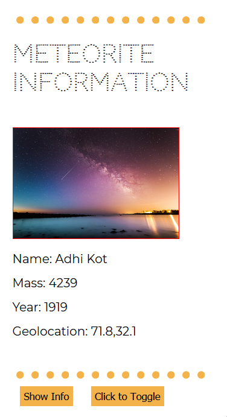

# Week 9 Response
## Date 3-23-20
## MART441.50, Julia Ballas


## Overview

Databases. This week we are collecting information from a datasource and displaying it in a meaningful way using jQuery and AJAX.

## Projects

- Meterorites
- JS Plugin `dots()`
- JS Plugin `dotted()`

## Process

- simple html
- Coding
  - Add jQuery to show JSON (1)
- Brainstorm Ideas for showing Data meaningfully
- Add CSS style
- JQuery Plug-in


I started with a small json file and ran straight into a 'cross-origin-request error'. Despite the fact I was using Firefox, it wanted my json to be a secure link, so I linked to the http:// at my github page. Then it still didn't work because I'd edited my json file and left out the end of a bracket. Cue the debugging music... I managed to fix the problem after using the console-log, a debugging code from Jquery's website, and another json file. Finally, I got my data to display. It consisted of [object Object][object Object], which is not meaningful at all.

Below is my first attempt to make the data appear, based on studying jQuery's `getJSON()` (2) and `.each()` methods (3). I totally just guessed if I could use `field.name` and was surprised it worked.
```javascript

  $("#show_information").append("Name: " + field.name + " Mass: " + field.mass + " Year: " + field.year.substr(0,4) + " Geolocation: " + field.geolocation.coordinates + "<br>" );
```

My second attempt to show the information, which is almost identical to the first, just using seperate div files.
``` javascript
       $("#name").text("Name: " + field.name);
          $("#mass").text(" Mass: " + field.mass);
          $("#year").text(" Year: " + field.year.substr(0,4));
          $("#geolocation").text(" Geolocation: " + field.geolocation.coordinates);
*/
```


Initially, I could only get a wall of text to appear, but I took our teacher's advise and looked back into previous weeks to find a solution. Week 7 was especially helpful. I created a class named `Rock`, and an array named `more_rocks` to push the data into.

After that small success, I moved on to my jquery plugin.

### Plugin Experiments

First, I tried image resizing and image duplicating, but it wasn't working. So, I took a break and changed my fonts to one called 'Codystar', which is made of dots (or stars). Then I changed my border to `border: 1px dotted black`. It was a very ugly dotted border.

Next, I did some research into changing the dotted border, and discovered it isn't really possible to change with css.

Ahha, a project for a plugin.


The image above shows the font I wanted to base my project around. The second arrow points to the standard thick dotted border, however you can't change sizing or spacing. Third is a line of dots I created using jquery and css.


## Problems or Issues this week

My dotted border plugin created all kinds of problems, mostly because I had to keep researching every little detail about it.

I found an article on medium.com which suggested using a svg image file for your border.(5) But updating the color is only possible if you go back and change for actual image, so it is not ideal. Since it is possible to create svg images directly in html, I'm going to try to create a border I can manipulate. After borrowing some svg circle code from w3 Schools, I adjusted the size and spacing.(6) Then I used a `for` loop to make it repeat inside the `<div>` tag 50 times.

I made several attempts to have the dot pattern appear inside a border, like a repeating image, but this didn't work out. The `border-image-source` is designed to use an actual image file that you can slice and repeat.(7) I was trying to take one round image that you repeat over and over. Using a repeating background-image also did not work. So I hardcoded 50 repeating images and used `overflow: hidden` to hide the excess. It is not a good solution, but I'm at a loss at what else to try, so I'm going to leave it for now.

Initially, my plugin simply displayed a specific row of black dots. But how do you customize it?

```js
// My first jQuery plugin to create a dot, it is not customizable.

(function ($){

  $.fn.dots = function(){
    // SVG circle code adjusted from W3Schools tutorial: www.w3schools.com/graphics/svg_circle.asp

    var circle = "<svg height='5' width='5'><circle cx='2' cy='2' r='2' fill='black'/></svg>"

    for (i = 0; i < 50 ; i ++){
        this.append(circle);
        this.css("height", "20px")
        this.css("overflow", "hidden")
    }
    return this;
  };
}(jQuery));
```

## A Customizable dotted line

I wanted to make my border customizable, like this:

```jQuery
//Ultimately this is what I want to code and make it display the image below.
$("div:).dots({
  spacing: 10
  radius: 5
  color: 'rgb(244, 178, 75)'
})
```


According to a jQuery tutorial, there is a way to add options to your plugin. (8) So that was my next attempt.

I added the 3 options using jQuery's`.extend()`. Then I had to figure out where to put my variables, and the SVG circle.

Finally, something clicked and I knew right away I needed to have `setting.spacing`, `setting.color` and `setting.radius` in my variable and in the `this.return.css` section. I added comments throughout. There is still one major issues with it: controlling how many dots appear. That's where I'm stuck and I have no idea how to fix it, but I'm very happy to see my `dotted()` plugin customizable.

## Conclusion

This week was hard because we had two very different tasks to work on and I was torn between them. Displaying data in a meaningful way is much harder than I ever realized. I saw wonderful examples on youtube,(https://www.youtube.com/watch?v=qVh2Qw5KSFg) but I could only get my data to display in a readable format, which is not exciting or meaningful.

The plugin was another difficult task, and I wanted to make something useful. The idea behind plugins is that you take a complex idea and have it available to code now, or in other projects. I really liked my idea of making a dotted border you can customize. It's not completely functional as a plugin, but it is a good start.


## References
1. "jQuery getJSON() Method" w3schools.com. www.w3schools.com/jquery/ajax_getjson.asp
2. "jQuery.getJSON()" jQuery.com http://api.jquery.com/jQuery.getJSON/
3. "jQuery.each()". jQuery.com. http://api.jquery.com/jquery.each/

4. To only display part of a string, I used `.substr(0,4)`, which I discovered at StackOverFlow: http://stackoverflow.com/questions/3414916/display-only-10-characters-of-a-long-string

5. "Creating True Dotted Borders with CSS" Medium.com. http://medium.com/@luclemo/creating-true-dotted-borders-with-css-233f296d8145
6. "SVG <circle>" w3schools.com. www.w3schools.com/graphics/svg_circle.asp
7. "CSS border-image Property" w3schools.com. www.w3schools.com/cssref/css3_pr_border-image.asp
8. "How to Create a Basic Pluin" Jquery.com. http://learn.jquery.com/plugins/basic-plugin-creation/
