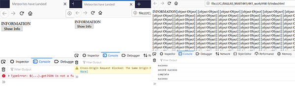

# Week 10 Response
## Date 3-23-20
## MART441.50, Julia Ballas


## Overview

Databases. This week we are collecting information from a datasource and displaying it in a meaningful way using jQuery and AJAX.

## Projects

- Meterorites
- JS Plugin

## Process

- simple html
- Coding
  - Add jQuery to show JSON
- Brainstorm Ideas for showing Data meaningfully
- Add CSS style
- JQuery Plug-in


I started with a small json file and tried to display it. I ran straight into a 'cross-origin-request error'. Despite the fact I was using Firefox, it wanted needed my json to be a secure link, so I link to a http: at my github page. Then it still didn't work because I'd edited my json file and left out the end of a bracket. So, after struggling and debugging for a while, I used the console-log and a debugging code from Jquery's website, and used another json file, then I finally got my data to display. It  consisted of [object Object][object Object], which is not meaningful at all.

Below is my first attempt to make the data appear, based on studying jQuery's `getJSON()` (2) and `.each()` methods (3). I totally just guessed if I could use `field.name` to make the meteorite name appear, and was surprised it worked.
```javascript

  $("#show_information").append("Name: " + field.name + " Mass: " + field.mass + " Year: " + field.year.substr(0,4) + " Geolocation: " + field.geolocation.coordinates + "<br>" );
```

My second attempt to show information, which is almost identical to the first, just using seperate div files.
``` javascript
       $("#name").text("Name: " + field.name);
          $("#mass").text(" Mass: " + field.mass);
          $("#year").text(" Year: " + field.year.substr(0,4));
          $("#geolocation").text(" Geolocation: " + field.geolocation.coordinates);
*/
```


Initially, I could only get a wall of text to appear, but as took our teacher's advise and looked back into previous weeks to find a solution. Week 7 was especially helpful. I created a class named `Rock` to put my data into. Then I created an array named `more_rocks` to push the new data into. Then I ran into the same problem where I was pushing too much data into my array, so I had to rearrange the code so that the button will only dispaly from my array.

After that small success, I moved on to my css and figureing out a jquery plugin.

### Plugin Testing

I started experimenting for a plugin and at first I was trying things with images, changing the size, etc. I tried to duplicate the image, but wasn't having much luck.

Taking a break, I decided to add in a different font and get my meteorite information to look better. I used a dotted font, and then I tried changing my border to a dotted and discovered it is very ugly dotted border.

So, I did some research into changing the dotted border and found out it isn't really possible to change with css.

Ahha, a project for a plugin.


The image above show the font I wanted to base my project around. The second arrow points to the standard thick dotted border, however you can't change sizing or spacing. Third is a line of dots I created in jquery and css.


## Problems or Issues this week

My dotted border create all kinds of problems, mostly because I had to keep researching every little detail about it.

I found an article on medium.com which gave a solution for using a svg image file for your border.(5) But updating the color is only possible if you go back and change for image, so it is not ideal. Since it is possible to create svg images directly in html, I'm going to try to create my own border I can manipulate. Borrowing some svg circle code from W3 schools, I adjusted the size and spacing to look more like a border. Then I used a `for` loop to make it repeat inside the `<div>` tag 50 times.

It should be possible to control the size of the dot, the spacing and the color.

I also made attempts to have the dot pattern appear only in the border, like a repeating image, but this didn't work out.

I tried to use the border-image-source to create a border image with my `<svg>`. However, it didn't work. The code is more designed to use an image file that you can slice and repeat.(7) I was trying to take one round image that you repeat over and over. Using a repeating background-image also did not work. So I had just left it as  50 images hardcoded and used `overflow: hidden` to hide the excess. It is not a good solution, but I'm at a loss at what else to try, so I'm going to leave it for now.


Ultimately, I settled on creating a dot border as my plugin. It simple displays a row of dots. I was curious how I could change the color and size of the dots and spacing of my dots. You could do it with a class. Or its possible to add options to your plugin (8)

## References
1) https://www.w3schools.com/jquery/ajax_getjson.asp
2) https://api.jquery.com/jQuery.getJSON/
3) https://api.jquery.com/jquery.each/

4) To only display part of a string, I used the `.substr(0,4)`, which I discovered at StackOverFlow: stackoverflow.com/questions/3414916/display-only-10-characters-of-a-long-string

5) https://medium.com/@luclemo/creating-true-dotted-borders-with-css-233f296d8145
6) https://www.w3schools.com/graphics/svg_circle.asp
7) https://www.w3schools.com/cssref/css3_pr_border-image.asp
8) https://learn.jquery.com/plugins/basic-plugin-creation/

## Specific questions/concerns for next week

I think I missed the point of the plugin assignment. I wanted to make my border customizable, like below:

```jQuery
$("div:).dots({
  spacing: 10;
  radius: 5;
  color: 'rgb(244, 178, 75)';
})
```


I have no idea if that's possible.

## Conclusion

This week was hard because we had two very different tasks to work on and I was torn between which one to focus on. Displaying data in a meaningful way is much harder than I ever realized. I saw wonderful examples on youtube,(https://www.youtube.com/watch?v=qVh2Qw5KSFg) but I could only get the my data to display in a readable format. It is not exciting or meaningful.

The plugin was another difficult task, not so much the code part, but figuring out a useful plugin. I didn't want to make a meaningless update to my css. The idea behind plugins is that you take a complex idea and simpfly it to make it easier to code now or in other projects. I really liked my idea of making a dotted border you can customize. The customizing part was really hard to impliment. It's not a very useful plugin as is.


